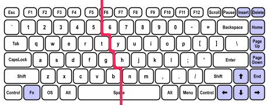

<!-- PROJECT SHIELDS -->
<!--
*** I'm using markdown "reference style" links for readability.
*** Reference links are enclosed in brackets [ ] instead of parentheses ( ).
*** See the bottom of this document for the declaration of the reference variables
*** for contributors-url, forks-url, etc. This is an optional, concise syntax you may use.
*** https://www.markdownguide.org/basic-syntax/#reference-style-links
-->
[![Contributors][contributors-shield]][contributors-url]
[![Forks][forks-shield]][forks-url]
[![Stargazers][stars-shield]][stars-url]
[![Issues][issues-shield]][issues-url]
[![MIT License][license-shield]][license-url]

<!-- PROJECT LOGO -->
<br />
<p align="center">
  <a href="https://github.com/reevesba/keystroke-biometrics">
    
  </a>

  <p align="center">
    Keystroke Data Analysis and Modeling
    <br />
    <a href="https://github.com/reevesba/keystroke-biometrics"><strong>Explore the docs »</strong></a>
    <br />
    <br />
    <a href="https://keystroke-biometrics" target="_blank">View Demo</a>
    ·
    <a href="https://github.com/reevesba/keystroke-biometrics/issues">Report Bug</a>
    ·
    <a href="https://github.com/reevesba/keystroke-biometrics/issues">Request Feature</a>
  </p>
</p>

<!-- TABLE OF CONTENTS -->
<details open="open">
  <summary>Table of Contents</summary>
  <ol>
    <li>
      <a href="#about-the-project">About The Project</a>
      <ul>
        <li><a href="#built-with">Built With</a></li>
        <li><a href="#data-collection">Data Collection</a></li>
        <li><a href="#feature-engineering">Feature Engineering</a></li>
        <li><a href="#model-selection">Model Selection</a></li>
        <li><a href="#evaluation">Evaluation</a></li>
        <li><a href="#optimization">Optimization</a></li>
      </ul>
    </li>
    <li>
      <a href="#getting-started">Getting Started</a>
      <ul>
        <li><a href="#prerequisites">Prerequisites</a></li>
        <li><a href="#installation">Installation</a></li>
      </ul>
    </li>
    <li><a href="#usage">Usage</a></li>
    <li><a href="#roadmap">Roadmap</a></li>
    <li><a href="#contributing">Contributing</a></li>
    <li><a href="#license">License</a></li>
    <li><a href="#contact">Contact</a></li>
  </ol>
</details>


<!-- ABOUT THE PROJECT -->
## About The Project
Keystroke biometrics, or keystroke dynamics, suggests that individuals may be identified by their typing rhythm. This is characterized as a behavioral biometric since the biometric factor is something a user does. This could have significant information security implications. For example, a malicious actor may be identified by their keystrokes similar to a fingerprint or signature. Outside of digital forensics, keystroke dynamics can be used for authentication systems. Essentially, the way an individual types a password would be more important than the password itself. This could be plausible as typing rhythm is extremely difficult to imitate. Another potential application is bot detection. Currently, CAPTCHAs are the default method of detecting bots. Most CAPTCHAs, including Google's reCAPTCHA, are vulnerable to adversarial machine learning attacks. An example CAPTCHA-breaking bot can be found [here](https://github.com/reevesba/captcha-bot). Alternative methods that utilize keystroke dynamics should be able to easily distinguish between bots and humans. The focus of this project will be on the latter application of detecting bots.  

### Built With
<a href="https://www.python.org/" target="_blank">
  
</a>
<a href="https://pandas.pydata.org/" target="_blank">
  
</a>
<a href="https://numpy.org/" target="_blank">
  
</a>
<a href="https://scikit-learn.org/stable/" target="_blank">
  
</a>

<br />
<br />

### Data Collection
Data for this project was collected using a [simple web application](https://keystrokebiometrics.xyz). Users are prompted with 10 sentences and asked to type the sentences in the input fields. These sentences are given in the following list.

- The quick brown fox jumped over the lazy dogs.
- Jackie will budget for the most expensive zoology equipment.
- A quick movement of the enemy will jeopardize six gunboats.
- Grumpy wizards make toxic brew for the evil queen and Jack.
- Watch "Jeopardy!", Alex Trebek's fun TV quiz game.
- When zombies arrive, quickly fax Judge Pat.
- The quick onyx goblin jumps over the lazy dwarf.
- Cozy lummox gives smart squid who asks for job pen.
- As quirky joke, chefs won't pay devil magic zebra tax.
- Zelda might fix the job growth plans very quickly on Monday.

As you can likely see, these sentences are just random pangrams. The site logs keystrokes by saving any keyup and keydown events to a MySQL database. The data collected is described in the following table.

| Field Name | Data Type   | Description                   |
| ---------- | ----------- | ----------------------------- |
| uuid       | varchar(50) | Universally unique identifier |
| key_event  | varchar(10) | 'keyup' or 'keydown'          |
| key_code   | int         | Key numeric identifier        |
| key_char   | varchar(10) | Key character identifier      |
| alt_key    | tinyint(1)  | Alt key was pressed           |
| ctrl_key   | tinyint(1)  | Control key was pressed       |
| shift_key  | tinyint(1)  | Shift key was pressed         |
| is_bot     | bool        | Data entered by bot           |
| timestamp  | bigint      | Time since Unix Epoch (ms)    |

### Feature Engineering
Unfortunately, the collected data cannot immediately identify a user's keystroke biometrics. New features must be created from this data to be useful for modeling.

### Data Cleaning
As humans are imperfect beings, erroneous characters are collected in addition to the requested characters. We must first remove any erroneous characters from the dataset.

### Feature selection
There are thousands of potential features in this dataset. Most of these features can be generalized as **Dwell Time** (or hold time) and **Flight Time** (or latency). Dwell time refers to the time duration that a key is pressed. This alone could give us 26+ features (one for each valid key). Flight time refers to the time duration in between keystrokes. Two primary variations include the time duration between two consecutive key down events and the time duration between releasing a key (keyup) and pressing the next key (keydown). This could give us another 2,704+ features (52 lower and upper case characters squared). Because I am using every letter in the alphabet in my sentences, I will need to find another way of deriving features. One other potentially useful feature could be the characters typed per minute. 

To reduce the dimensionality, I will try a more generalized approach to dwell and flight times. First, I will divide the keyboard into two sections according to the typical touch-typing convention. 



Any key to the left of the red line is reduced to left (l) and any key to the right of the red line is reduced to right (r). If shift is pressed, the key is represented as an upper-case character (L and R). Extracted features can now be described by the following table. You may notice that no features are going from a lowercase key to an uppercase key. This is left out due to its rarity in natural language.

<table>
    <caption><b>Extracted Features</b></caption>
    <tr>
        <th></th>
        <th>Label</th>
        <th>Description</th>
    </tr>
    <tr>
        <td rowspan="8"><b>Flight Time</b></td>
        <td>lr</td>
        <td>Transition from left hand to right hand</td>
    </tr>
    <tr>
        <td>Lr</td>
        <td>Transition from left hand + shift to right hand</td>
    </tr>
    <tr>
        <td>rl</td>
        <td>Transition from right hand to left hand</td>
    </tr>
    <tr>
        <td>Rl</td>
        <td>Transition from right hand + shift to left hand</td>
    </tr>
    <tr>
        <td>ll</td>
        <td>Transition from left hand to left hand</td>
    </tr>
    <tr>
        <td>Ll</td>
        <td>Transition from left hand + shift to left hand</td>
    </tr>
    <tr>
        <td>rr</td>
        <td>Transition from right hand to right hand</td>
    </tr>
    <tr>
        <td>Rr</td>
        <td>Transition from right hand + shift to right hand</td>
    </tr>
    <tr>
        <td rowspan="6"><b>Dwell Time</b></td>
        <td>l</td>
        <td>Hold duration of left hand</td>
    </tr>
    <tr>
        <td>r</td>
        <td>Hold duration of right hand</td>
    </tr>
    <tr>
        <td>L</td>
        <td>Hold duration of left hand + shift</td>
    </tr>
    <tr>
        <td>R</td>
        <td>Hold duration of right hand + shift</td>
    </tr>
    <tr>
        <td>Space</td>
        <td>Hold duration of space bar</td>
    </tr>
    <tr>
        <td>Shift</td>
        <td>Hold duration of shift key.</td>
    </tr>
    <tr>
        <td><b>Characters/Minute</b></td>
        <td>CPM</td>
        <td>Average number of keys pressed in one minute</td>
    </tr>
</table>

### Model Selection
The following classification algorithms were selected for initial testing. They were all run with SciKit-Learn's default parameters.
- Naive Bayes
- Logistic Regression
- K-Nearest Neighbors
- Support Vector Machine
- Decision Tree
- Decision Tree w/ Bagging
- Decision Tree w/ Boosting
- Random Forest
- Voting Classifier
  - Naive Bayes
  - Logistic Regression
  - Random Forest
  - Support Vector Machine
- Multilayer Perceptron

### Evaluation
Each model was evaluated using 5-fold cross-validation. The results were good for all classifiers.

| Algorithm                 | Score  |
| ------------------------- | ------ |
| Naive Bayes               | 0.9726 |
| Logistic Regression       | 0.9726 |
| K-Nearest Neighbors       | 0.9945 |
| Support Vector Machine    | 0.9726 |
| Decision Tree             | 0.9726 |
| Decision Tree w/ Bagging  | 0.9534 |
| Decision Tree w/ Boosting | 0.9726 |
| Random Forest             | 0.9836 |
| Voting Classifier         | 0.9753 |
| Multilayer Perceptron     | 0.9781 |

### Optimization
A grid search was performed on the top two algorithms, Random Forest and K-Nearest Neighbors, using the following parameters.

1. Random Forest
    - n_estimators: [10, 100, 1000]
    - max_depth: [5, 10, 15]
    - min_samples_leaf: [1, 2, 5, 10]
    - max_leaf_nodes: [2, 5, 10]
2. K-Nearest Neighbors
    - n_neighbors: [5, 10, 15]
    - weights: [uniform, distance]
    - metric: [euclidean, manhattan]

Grid Search Results
- Classifier: Random Forest
- n_estimators: 100
- max_depth: 5
- min_samples_leaf: 1
- max_leaf_nodes: 5

<!-- GETTING STARTED -->
## Getting Started
This repository can be cloned locally to quickly start analyzing keystroke data.

### Installation
1. Clone the repo.
   ```sh
   git clone https://github.com/reevesba/keystroke-biometrics
   ```
<!-- USAGE EXAMPLES -->
## Usage
There are many things this project can be used to explore. These include, but are not limited to:

- Improving feature selection
- Improving modeling

<!-- ROADMAP -->
## Roadmap
See the [open issues](https://github.com/reevesba/keystroke-biometrics/issues) for a list of proposed features (and known issues).

It would be great to generate more realistic bot keystrokes. Maybe using a GAN or Gaussian Mixture Model.

<!-- CONTRIBUTING -->
## Contributing
Contributions are what make the open-source community such an amazing place to learn, inspire, and create. Any contributions you make are **greatly appreciated**.

1. Fork the Project
2. Create your Feature Branch (`git checkout -b feature/newFeature`)
3. Commit your Changes (`git commit -m 'adding new feature xyz'`)
4. Push to the Branch (`git push origin feature/newFeature`)
5. Open a Pull Request

<!-- LICENSE -->
## License
Distributed under the GPLv3 License. See `LICENSE` for more information.

<!-- CONTACT -->
## Contact
Bradley Reeves - reevesbra@outlook.com

Project Link: [https://github.com/reevesba/keystroke-biometrics](https://github.com/reevesba/keystroke-biometrics)

<!-- MARKDOWN LINKS & IMAGES -->
<!-- https://www.markdownguide.org/basic-syntax/#reference-style-links -->
[contributors-shield]: https://img.shields.io/github/contributors/reevesba/keystroke-biometrics.svg?style=for-the-badge
[contributors-url]: https://github.com/reevesba/keystroke-biometrics/graphs/contributors
[forks-shield]: https://img.shields.io/github/forks/reevesba/keystroke-biometrics.svg?style=for-the-badge
[forks-url]: https://github.com/reevesba/keystroke-biometrics/network/members
[stars-shield]: https://img.shields.io/github/stars/reevesba/keystroke-biometrics.svg?style=for-the-badge
[stars-url]: https://github.com/reevesba/keystroke-biometrics/stargazers
[issues-shield]: https://img.shields.io/github/issues/reevesba/keystroke-biometrics.svg?style=for-the-badge
[issues-url]: https://github.com/reevesba/keystroke-biometrics/issues
[license-shield]: https://img.shields.io/github/license/reevesba/keystroke-biometrics.svg?style=for-the-badge
[license-url]: https://github.com/reevesba/keystroke-biometrics/blob/master/LICENSE.txt